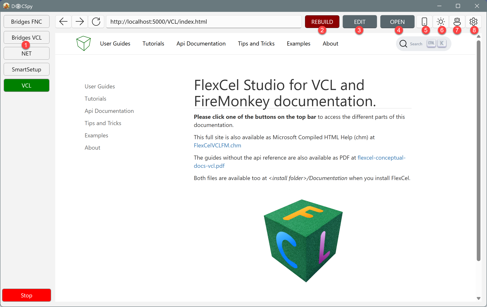

# docspy
A tool to review html docs locally

A simple web server with a web browser to look at generated docs. 

Allows you to see your docs in dark/light mode, in phone sizes, and can call the documentation generator to create new versions.

## Getting started

### Downloading the latest version

You can get the latest release at https://github.com/agallero/docspy/releases/latest

### Using the app

Once you start the app in a new machine, you will see this settings screen:


Here, you can press the "Pencil" icon (1) and create a default configuration file with the info for your projects.

### Configuring the sites

To configure the sites, you need to edit the configuration file. For each site you want to look at, you define a section with the name of the site.
For example:
```ini
[My site]
  source = c:\doc\Site1\_site  <- Place where the html generated docs are.
  command = {{xmldocer}} <- Command to compile the docs. This command will be called when you press the "Compile" button.
  command-arguments = VCL {{params}} config.site1.ini  <- Arguments to pass to the doc generator.
  editor = {{vscode}}  <- Editor used to open the source files when you click the "Edit" button.
  editor-arguments = c:\doc\Site1\source\ c:\doc\Site1\source\{{_rel-path_}}.md <- Arguments to pass to the editor

```
  * You can use {{variables}} to avoid writing the same in every section. For example, in the above example we use `{{vscode}}` This is defined in a special `[_Config_]` section of the configuration file. You can define whatever variables you want there, and use them in the other sections. For example:

```ini
[_Config_]
  vscode = C:\Users\adrian\AppData\Local\Programs\Microsoft VS Code\Code.exe
```

> [!NOTE]
> If using vscode as editor, it is useful to pass a folder *and* the file as different parameters. Passing the folder will open all pages of the site in the sidebar, and passing the file will open the specific file you are looking at, so you can edit it and then rebuild. You can either pass a folder or a VSCode workspace. There is a predefined `{{_rel_path}}` variable that you holds the relative path of the html page you are looking at in the browser (without the `.html` extension), and you can use it to open the corresponding .md file to edit.

### Main screen
Once you have the settings done, and press `Ok` it should go to the following screen:



1. Those are the sites you defined in the configuration. Press them to look at them.
2. **Rebuild button**: Will call the `command` if there is one defined in the configuration, and pass the `command-arguments` to it. Use it to rebuild the docs after changes.
3. **Edit button**: Will call the `editor` command and pass the `editor-arguments`. Use it to edit the `.md` file associated with the `.html` file you are looking at.
4. **Open button**: Will show a popup to open the html in a real browser, or open a file explorer where the html files are.
5. **Size button**: Use it to resize the screen to a phone/tablet size.
6. **Dark/Light mode button**: Will restart the app in Dark/Light mode so yo can see how the docs look in the different modes.
7. **JavaScript button**: Will show how the site looks when JavaScript is disabled.
8. **Settings button**: Will go to the settings page where you can edit the configuration file
